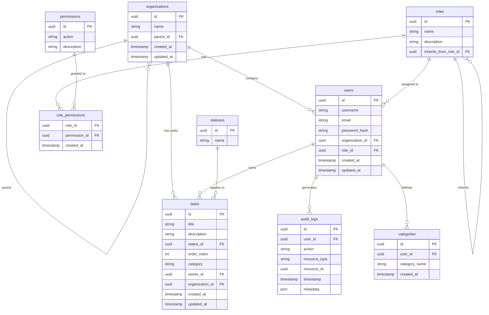

# Secure Task Management System

A full-stack task management application with role-based access control (RBAC), built in an NX monorepo with NestJS (API) and Angular (dashboard).

---

## Table of Contents

- Setup Instructions
- Environment Configuration
- Architecture Overview
- Tech stack & design choices
- Data Model & Schema
- Access Control Implementation
- Scalability: Database-Driven Configuration
- API Documentation
- Tests
- Features Achieved
- Tradeoffs & Unfinished Areas
- Future Considerations

---

## Setup Instructions

### Run with Docker (recommended)

The easiest way to run the full stack is with Docker. No need to install Node.js or PostgreSQL locally.

1. **Copy and edit env (required so Compose gets port/DB values):**

   ```bash
   cp .env.example .env
   ```

   Edit `.env` and set at least `JWT_SECRET`, `POSTGRES_PASSWORD`, and optionally `PORT_API`, `PORT_DASHBOARD`, `PORT_POSTGRES`. See [Environment Configuration](#environment-configuration).

2. **Install dependencies**

    ```bash
    npm install
    ```

    If you see peer dependency or engine warnings:

    ```bash
    npm install --legacy-peer-deps
    ```

3. **Production stack (Backedn + Frontend + Database):**

   ```bash
   docker compose up --build
   ```

   Compose automatically loads `.env` from the project root. Services:

   - **API (Nest.js):** `http://localhost:3011/api` (or `PORT_API` from `.env`)
   - **Dashboard (Angular):** `http://localhost:4200` (or `PORT_DASHBOARD`)
   - **Database (PostgreSQL):** host port 5433 (or `PORT_POSTGRES`)

   On first run, seed creates a default user: **admin@example.com** / **admin123** (role: owner).

3. **Development stack (hot reload for API and dashboard):**

   ```bash
   docker compose -f docker-compose.dev.yml up --build
   ```

   Uses the same `.env`. API and dashboard run with volume mounts for live code changes.

**How to modify the env file**

- **File to use:** `.env` in the project root. Docker Compose **only** auto-loads a file named `.env`.
- **Variables you can change:** Ports (`PORT_API`, `PORT_DASHBOARD`, `PORT_POSTGRES`), API (`PORT`, `GLOBAL_PREFIX`, `JWT_SECRET`, `NODE_ENV`), Database (`POSTGRES_*`, `DB_*`), and **Dashboard:** `API_PUBLIC_URL` (URL the browser uses to call the API). In the production image this is injected at container start from env.
- After editing `.env`, restart: `docker compose down && docker compose up -d` (or with `-f docker-compose.dev.yml` for dev).

---

### Optional: Run without Docker

To run the API and dashboard directly on your machine (e.g. for development):

**Prerequisites**

- **Node.js** 18+ (20+ recommended for Angular 21)
- **npm** 8+
- **PostgreSQL** 12+

**Install dependencies**

```bash
npm install
```

If you see peer dependency or engine warnings:

```bash
npm install --legacy-peer-deps
```

**Environment**

Create a `.env` file (e.g. `cp .env.example .env`). Set **JWT_SECRET**, **DB_HOST**, **DB_PORT**, **DB_USERNAME**, **DB_PASSWORD**, **DB_DATABASE**. Ensure PostgreSQL is running and the database exists:

```bash
createdb secure_task_system
```

**Run backend**

```bash
npm run start:api
```

- API: `http://localhost:3011/api` (default port 3011). Seed creates **admin@example.com** / **admin123** on first run.

**Run frontend**

```bash
npm run start:dashboard
```

- Dashboard: `http://localhost:4200`. Ensure the API is running.

**Build for production**

```bash
npm run build:api
npm run build:dashboard
```

---

## Environment Configuration

| Variable | Description | Example |
|----------|-------------|---------|
| `PORT` | API server port | `3011` |
| `GLOBAL_PREFIX` | API path prefix | `api` |
| `JWT_SECRET` | Secret for signing JWTs; **must be strong in production** | `your-super-secret-key` |
| `DB_HOST` | PostgreSQL host | `localhost` or `postgres` (Docker) |
| `DB_PORT` | PostgreSQL port | `5432` |
| `DB_USERNAME` | DB user | `postgres` |
| `DB_PASSWORD` | DB password | (set securely) |
| `DB_DATABASE` | Database name | `secure_task_system` |
| `POSTGRES_USER`, `POSTGRES_PASSWORD`, `POSTGRES_DB` | Used by Postgres container | Same as above for consistency |
| `PORT_API`, `PORT_DASHBOARD`, `PORT_POSTGRES` | Host ports in Docker Compose | `3011`, `4200`, `5433` |
| `API_PUBLIC_URL` | URL the dashboard uses to call the API (Docker) | `http://localhost:3011/api` |

---

## Architecture Overview

### NX monorepo layout and rationale

- **apps/api** – NestJS backend: REST API, JWT auth, TypeORM (PostgreSQL), RBAC guards, audit logging, seed. All HTTP endpoints live here; guards and decorators enforce permissions and org scope.
- **apps/dashboard** – Angular SPA: login, Kanban board (tasks, statuses, categories), create/edit/delete, sort/filter, drag-and-drop (CDK), task graph, access logs, control panel (owner), responsive UI (Tailwind, PrimeNG).
- **libs/data** – Shared TypeScript interfaces and DTOs (User, Organization, Task, Role, CreateTaskDto, LoginDto, JwtPayload, etc.). Used by the API and can be used by the dashboard for type safety.
- **libs/auth** – Reusable RBAC logic: permission constants, role–permission map, role inheritance, `hasPermission()`, `hasRoleOrAbove()`, `getEffectivePermissions()`. The API implements Nest guards and decorators that use this lib; the dashboard uses the same role names for UI (e.g. control panel for owner only).

**Rationale:** Shared DTOs and RBAC rules in libs keep the API and future apps consistent. Nest guards and JWT strategy stay in the API where Nest’s DI and HTTP context are available; the auth lib remains framework-agnostic.

### Tech stack & design choices

- **UI (PrimeNG):** Used for the dashboard so the app gets a consistent, accessible component library (tables, dialogs, dropdowns, etc.) without building everything from scratch.
- **State management (NgRx):** Used so task, auth, and app state are predictable, testable, and easy to debug with a single source of truth and clear data flow.
- **Interfaces and enums:** Used across the codebase (e.g. in `libs/data` and `libs/auth`) to avoid hard coding and keep types, statuses, and permissions consistent and refactor-safe.

### Shared libraries and modules

- **@secure-task-system/data** – DTOs and interfaces for auth, tasks, organizations, users. Single source of truth for request/response shapes.
- **@secure-task-system/auth** – Permissions enum, role inheritance, and permission checks. No HTTP or DB; pure functions so both API and tests can reuse the same rules.

---

## Data Model & Schema

### Schema description

- **users** – `id` (UUID), `username`, `email`, `password_hash`, `organization_id` (nullable), `role_id`, `created_at`, `updated_at`. Users belong to one organization (nullable for owner-with-no-org) and one role.
- **roles** – `id`, `name`, `description`, `inherits_from_role_id` (nullable). Roles can inherit from another role; permissions are resolved via `role_permissions` and inheritance.
- **permissions** – `id`, `action` (e.g. `task:create`, `audit:read`), `description`.
- **role_permissions** – `role_id`, `permission_id`. Many-to-many between roles and permissions (used when roles/permissions are stored in DB; current code also uses in-memory `ROLE_PERMISSIONS` in libs/auth for guards).
- **organizations** – `id`, `name`, `parent_id` (nullable). Two-level hierarchy: root orgs (`parent_id` null) and child orgs.
- **tasks** – `id`, `title`, `description`, `status_id`, `order_index`, `category` (string), `owner_id`, `organization_id`, `created_at`, `updated_at`. Tasks are scoped by organization; status and category reference lookup tables or free text.
- **statuses** – `id`, `name` (e.g. `todo`, `in_progress`, `done`, `blocked`). Seeded; used for Kanban columns and task lifecycle.
- **categories** – `id`, `user_id` (nullable), `category_name`, `created_at`. Optional user-scoped categories.
- **audit_logs** – `id`, `user_id`, `action`, `resource_type`, `resource_id`, `timestamp`, `metadata` (JSONB). Audit trail for task and other actions.

### Pre Seeded Users:

- **admin@example.com** / **admin123** (role: owner)
- **admin2@example.com** / **admin123** (role: admin)
- **admin3@example.com** / **admin123** (role: admin)
- **usera@example.com** / **password** (role: viewer)
- **userb@example.com** / **password** (role: viewer)
- **userc@example.com** / **password** (role: viewer)
- **userd@example.com** / **password** (role: viewer)
- **usere@example.com** / **password** (role: viewer)
- **userf@example.com** / **password** (role: viewer)

### ERD (Entity-Relationship Diagram)



---

## Access Control Implementation

### Roles, permissions, and organization hierarchy

- **Roles (hierarchy):** **viewer** &lt; **admin** &lt; **owner**. Stored in DB (`roles` table) and mirrored in code (`libs/auth`). Owner can see all orgs; admin/viewer are scoped to their org (and parent org can see child org tasks).
- **Permissions:** Fine-grained actions: `task:create`, `task:read`, `task:update`, `task:update_status`, `task:delete`, `audit:read`, `organization:create`, `user:read`, `user:create`, `user:update`, `user:reset-password`. Guards use `@RequirePermissions(...)` or `@RequireAnyOfPermissions(...)`.
- **Organization hierarchy:** Two levels. Root orgs (`parent_id` null); child orgs created via `POST /api/organizations`. Users belong to one org. Tasks belong to one org. Owner (with no org) can create tasks in any org by choosing `organizationId`; admin/viewer see only their org (and parent sees child org data where implemented).

### Role inheritance and RBAC

- **Inheritance:** Viewer is the base; admin inherits viewer; owner inherits admin. `getEffectivePermissions(role)` walks the chain and merges permissions so owner has all viewer + admin + owner permissions.
- **Guards:** `JwtAuthGuard` validates JWT and attaches user to request. `PermissionsGuard` reads `@RequirePermissions` / `@RequireAnyOfPermissions` and calls `hasPermission(user.role, permission)` from `@secure-task-system/auth`. Task and audit endpoints also enforce organization scope (same org or owner with global access).

### How JWT authentication integrates

- Login: `POST /api/auth/login` with email/password returns `access_token` (JWT) and `user` (id, email, role, organizationId). No refresh token in current implementation.
- Protected routes require header: `Authorization: Bearer <access_token>`.
- JWT payload includes `sub`, `email`, `role`, `organizationId`. Guards use this to check permissions and org scope; no extra DB lookup for role when using in-memory RBAC.

---

## Scalability: Database-Driven Configuration

The codebase is designed so that **statuses, column order, roles, permissions, and organizations** can come from the database, making it scalable without code changes for new statuses or roles.

- **Statuses:** Stored in `statuses` table; seeded with `todo`, `in_progress`, `done`, `blocked`. Dashboard orders columns via a fixed order array (`TASK_STATUS_ORDER`) for display, but the list of statuses is loaded from the API. Adding a new status in the DB and (if desired) in the frontend order array is sufficient.
- **Categories:** Stored in `categories` table; user- or org-scoped. Dashboard and API use them from the API.
- **Roles and permissions:** Entities exist in DB (`roles`, `permissions`, `role_permissions`). The auth lib currently uses in-memory `ROLE_PERMISSIONS` and `ROLE_INHERITANCE` for guards; these can be replaced or supplemented by DB-backed lookups so new roles/permissions can be added without code deploy.
- **Organizations:** Fully DB-driven; two-level hierarchy and scoping are enforced in services using `organizationId` and parent/child relationships.

**RBAC and inheritance:** The auth lib implements inheritance in code (viewer → admin → owner). For DB-driven roles, the `roles.inherits_from_role_id` column supports the same idea: resolve effective permissions by walking the parent chain and merging permissions from `role_permissions`. This design allows future roles (e.g. “manager”) to inherit from “viewer” or “admin” and get the right permissions without hardcoding.

---

## API Documentation

### Endpoint list

| Method | Endpoint | Auth | Permission | Description |
|--------|----------|------|------------|-------------|
| POST | `/api/auth/login` | No | - | Login; returns `access_token` and `user`. |
| GET | `/api` | No | - | Health / info. |
| GET | `/api/statuses` | JWT | - | List statuses (for Kanban). |
| GET | `/api/categories` | JWT | - | List categories. |
| POST | `/api/tasks` | JWT | task:create | Create task (body: title, optional description, statusId, category, organizationId for owner). |
| GET | `/api/tasks` | JWT | task:read | List tasks (scoped to user’s org / owner all). |
| GET | `/api/tasks/:id` | JWT | task:read | Get one task. |
| PUT | `/api/tasks/:id` | JWT | task:update or task:update_status | Update task (viewer: status only). |
| DELETE | `/api/tasks/:id` | JWT | task:delete | Delete task. |
| GET | `/api/audit-log` | JWT | audit:read | List audit entries (Owner/Admin). |
| POST | `/api/organizations` | JWT | organization:create | Create child org (body: `name`). Owner/Admin. |
| GET | `/api/organizations` | JWT | - | List your org and its direct children. |
| GET | `/api/users` | JWT | user:read | List users (Admin: org; Owner: all or by org). |
| GET | `/api/roles` | JWT | - | List roles. |

Base URL when running locally: `http://localhost:3011/api` (or your `PORT` and `GLOBAL_PREFIX`).

### Sample requests and responses

**Login**

```bash
curl -X POST http://localhost:3011/api/auth/login \
  -H "Content-Type: application/json" \
  -d '{"email":"admin@example.com","password":"admin123"}'
```

Response:

```json
{
  "access_token": "eyJhbGciOiJIUzI1NiIs...",
  "user": {
    "id": "...",
    "email": "admin@example.com",
    "role": "owner",
    "organizationId": "..."
  }
}
```

**Create task** (replace `TOKEN` with the access_token)

```bash
curl -X POST http://localhost:3011/api/tasks \
  -H "Content-Type: application/json" \
  -H "Authorization: Bearer TOKEN" \
  -d '{"title":"My first task","category":"work"}'
```

**List tasks**

```bash
curl -H "Authorization: Bearer TOKEN" http://localhost:3011/api/tasks
```

**List audit log**

```bash
curl -H "Authorization: Bearer TOKEN" http://localhost:3011/api/audit-log
```

---

## Tests

### How to run tests

- **API (Jest):**
  ```bash
  npm run test:api
  # or: npx nx test api
  ```
- **Dashboard (Jest):**
  ```bash
  npm run test:dashboard
  # or: npx nx test dashboard
  ```

### Example tests (2–3)

**1. RBAC: owner has task:create via inheritance (libs/auth)**  
`libs/auth/src/lib/rbac.spec.ts`

```ts
it('owner has task:create (via admin)', () => {
  expect(hasPermission('owner', Permission.TASK_CREATE)).toBe(true);
});
it('admin includes viewer permissions', () => {
  const perms = getEffectivePermissions('admin');
  expect(perms).toContain(Permission.TASK_READ);
  expect(perms).toContain(Permission.TASK_UPDATE_STATUS);
  expect(perms).toContain(Permission.TASK_CREATE);
  expect(perms).toContain(Permission.AUDIT_READ);
});
```

**2. Auth: login returns token and user (API)**  
`apps/api/src/app/auth/auth.service.spec.ts`

```ts
it('should return access_token and user on valid credentials', async () => {
  bcrypt.compare.mockResolvedValue(true);
  userRepo.findOne = jest.fn().mockResolvedValue(mockUser);
  const result = await service.login('admin@example.com', 'admin123');
  expect(result.access_token).toBe('jwt-token');
  expect(result.user.email).toBe('admin@example.com');
  expect(result.user.role).toBe('owner');
});
```

**3. Permissions guard: allows owner for audit:read (API)**  
`apps/api/src/app/auth/permissions.guard.spec.ts`

```ts
it('allows owner for audit:read (admin permission)', () => {
  const ctx = createMockContext({ role: 'owner' });
  const guard = new PermissionsGuard(...);
  expect(guard.canActivate(ctx)).toBe(true);
});
```

---

## Features Achieved

- **Auth:** Login with email/password; JWT access token; role (owner, admin, viewer) and organizationId in token.
- **Tasks:** Full CRUD; status (todo, in progress, done, blocked); categories; order index; scoped by organization; owner can select org when creating.
- **Organizations:** Two-level hierarchy (root + children); create child org (Owner/Admin); list org and children.
- **RBAC:** Permissions and role inheritance (viewer &lt; admin &lt; owner); guards on all task, audit, org, and user endpoints.
- **Audit:** Log task create/update/delete (and optionally other actions); GET audit-log for Owner/Admin.
- **Dashboard:** Kanban board; drag-and-drop; filters (category, search, created by); sort; create/edit/delete task; task graph; access logs; control panel (owner only); theme toggle; responsive UI.
- **Docker:** Production and dev compose; env-based config; dashboard API URL from env at runtime in production image.
- **Tests:** API (auth, tasks, organizations, audit, users, permissions guard); dashboard (login, guards, tasks reducer, TasksService); auth lib (RBAC and inheritance).

---

## Tradeoffs & Unfinished Areas

- **Session token in cookies:** Tokens are stored in **localStorage** (dashboard). A **tradeoff** is to move to **httpOnly cookies** for the access (or refresh) token to reduce XSS risk; that would require backend to set cookies on login and CORS/credentials, and possibly CSRF protection.
- **Caching for GET requests:** No HTTP or in-memory caching for GET (tasks, statuses, categories, organizations). Adding **caching** (e.g. short TTL for GET) would reduce DB load and improve scalability; tradeoff is cache invalidation on write.
- **User and organization management for owner:** **Owner** can list users and (where implemented) create child orgs. **Not fully implemented:** UI for owner to create/update users, assign roles, or manage organizations beyond create child org. Marked as **future**: full user and organization management for owner (e.g. invite user, change role, deactivate).
- **User management for admin:** **Admin** has `user:read` and can list users in their org. **Not implemented:** Admin UI to edit users in their org (e.g. change role to viewer). Listed as **future**.
- **Reset password:** Permission `user:reset-password` exists in RBAC and is assigned to owner; **no endpoint or UI** for reset password yet. Documented as **future**.
- **PostgreSQL:** Default DB; use env `DB_*` for connection. Production should use `synchronize: false` and migrations.
- **Single JWT secret:** No key rotation or refresh tokens; production would add refresh tokens and short-lived access tokens.
- **Audit:** Stored in DB and logged to console; no file sink or SIEM integration.
- **Drag-and-drop:** Reorder updates `orderIndex` via PUT; a single “reorder” batch endpoint could reduce round-trips.
- **Repository name:** Repo is `secure-task-system-docker`; can be renamed for submission (e.g. `jdoe-uuid`).

---

## Future Considerations

- **Advanced role delegation:** Allow owners to define custom roles or assign permissions per user/team via DB-driven roles and `role_permissions`.
- **Production-ready security:**
  - **JWT refresh tokens** and short-lived access tokens; store refresh token server-side or in httpOnly cookie.
  - **CSRF protection** for cookie-based or hybrid auth.
  - **RBAC caching:** Cache effective permissions per request or short TTL to reduce lookups at scale.
- **Efficient scaling of permission checks:** Move to a policy engine (e.g. OPA, Casbin) if rules become complex or need to be configurable without code changes.
- **User and organization management:** Owner UI for creating/editing users, assigning roles, and managing organizations; admin UI for editing users in their org.
- **Reset password:** Implement endpoint and (optional) UI for owner-triggered password reset using `user:reset-password`.

---

## Diagram (high-level)

```
┌─────────────────────────────────────────────────────────────────┐
│                        NX Monorepo                              │
├─────────────────────────────────────────────────────────────────┤
│  apps/api (NestJS)          │  apps/dashboard (Angular)         │
│  - AuthModule (JWT, login)  │  - LoginComponent                 │
│  - TasksModule (CRUD)       │  - TaskBoardComponent             │
│  - AuditModule, UsersModule │  - TaskGraphComponent, AccessLogs │
│  - Guards, Decorators       │  - Control panel (owner)          │
├─────────────────────────────────────────────────────────────────┤
│  libs/data                   │  libs/auth                       │
│  - Interfaces, DTOs          │  - Permissions, hasPermission,   │
│  - Role, TaskStatus, etc.    │    getEffectivePermissions       │
└─────────────────────────────────────────────────────────────────┘
                │                             │
                └──────────────┬──────────────┘
                               ▼
        PostgreSQL (users, roles, organizations, tasks, 
        statuses, categories, audit_logs)
```
